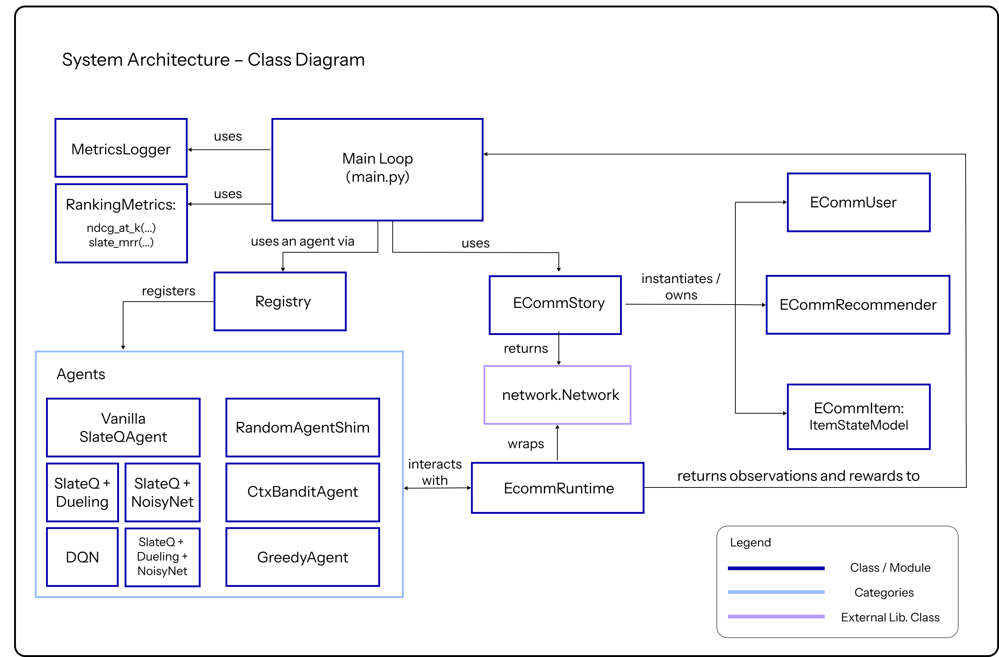
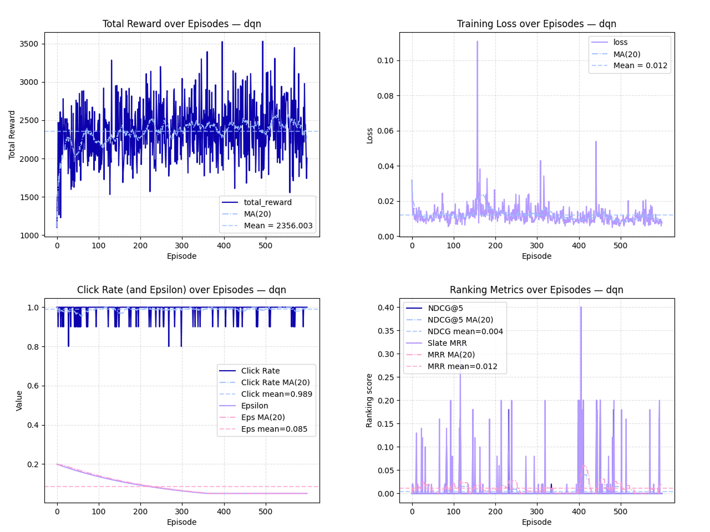

# SlateQ-RecSys-Research

This repository contains my dissertation project at the University of Bath for the MSc Computer Science degree. It implements and evaluates slate-based reinforcement learning algorithms in a recommender system simulation environment, built on [**RecSim NG**](https://github.com/google-research/recsim_ng) (Google’s next-generation simulator for recommender system research) [[Mladenov et al., 2021]](https://arxiv.org/abs/2103.08057).

The project investigates the [**SlateQ algorithm**](https://www.ijcai.org/proceedings/2019/0360.pdf) [[Ie et al., 2019]](https://www.ijcai.org/proceedings/2019/0360.pdf) and its variants, comparing them against simpler baselines such as random, greedy, and contextual bandit approaches. The primary focus is on analysing long-term user dynamics, evaluating ranking quality, and assessing the ability of learning agents to outperform short-sighted heuristics.


---

## Project Structure

```
SlateQ-RecSys-Research/                 # Project root
├── main.py                             # Entry point: training loop, logging, plotting
├── experiments/                        # Experiment configuration files
│   └── configs/
│       └── base.gin                    # Gin config for environment and agent parameters
├── src/                                # Source code
│   ├── agents/                         # Implemented agent baselines and RL algorithms
│   │   ├── random_agent.py             # Random slate selection
│   │   ├── greedy_agent.py             # Greedy baseline (affinity only)
│   │   ├── ctxbandit_agent.py          # Contextual bandit baseline
│   │   ├── slateq_agent.py             # Vanilla SlateQ agent
│   │   ├── slateq_dueling_agent.py     # SlateQ with duelling Q-network
│   │   ├── slateq_noisynet_agent.py    # SlateQ with noisy layers for exploration
│   │   ├── slateq_dueling_noisynet_agent.py  # SlateQ with duelling head + NoisyNet layers
│   │   └── dqn_agent.py                # Vanilla DQN agent (non-slate baseline)
│   ├── entities/                       # Core RecSim NG entity/state models
│   │   ├── ecomm_user.py               # User model with long-term interest dynamics
│   │   ├── ecomm_item.py               # Item catalogue with static features
│   │   └── ecomm_recommender.py        # Recommender agent state model
│   ├── stories/                        # Environment wiring
│   │   └── ecomm_story.py              # Connects user, item, recommender, and response
│   ├── runtimes/                       # Custom runtime wrappers
│   │   └── ecomm_runtime.py            # Runtime loop built on RecSim NG’s TFRuntime
│   ├── metrics/                        # Evaluation and logging utilities
│   │   ├── logger.py                   # Logs metrics to CSV and JSONL
│   │   └── ranking_metrics.py          # NDCG@K and slate MRR implementations
│   └── core/                           # Framework glue code
│       └── registry.py                 # Agent registry for easy instantiation
├── logs/                               # Auto-generated logs of training runs
│   └── <agent_name>/                   # Separate folder for each agent
│       └── run_YYYY_MM_DD_HH_MM/       # Run-specific directory
│           ├── metrics.csv             # Metrics logged in CSV
│           └── metrics.jsonl           # Metrics logged in JSON Lines
└── plots/                              # Auto-generated training plots
    └── <agent_name>/                                   # Separate folder for each agent
        └── run_YYYY_MM_DD_HH_MM_reward.png             # Reward vs episodes
        └── run_YYYY_MM_DD_HH_MM_loss.png               # Loss vs episodes
        └── run_YYYY_MM_DD_HH_MM_ranking.png            # NDCG@K and MRR vs episodes
        └── run_YYYY_MM_DD_HH_MM_click_epsilon.png      # Click rate and epsilon vs episodes
```
---

## System Architecture

The system integrates RecSim NG with custom agents, runtime, and evaluation tools. The diagram below shows how the main components interact, including the training loop, environment, agent registry, and metrics logging.

<p align="center">
  
</p>

**How it works**  
- **Main Loop (`main.py`)** drives experiments by loading configurations, instantiating agents, and running training.  
- **ECommStory** defines the simulation graph by connecting user, item, and recommender models, returning a RecSim NG `network.Network`.  
- **ECommRuntime** wraps the RecSim runtime and handles stepping through episodes while exchanging observations and rewards with agents.  
- **Agents** include multiple SlateQ variants, DQN, contextual bandits, greedy, and random policies, all registered via the agent `Registry`.  
- **MetricsLogger** and **RankingMetrics** handle training performance tracking and generate CSV/JSON logs as well as evaluation plots automatically

---

## Installation

This project assumes Python 3.10+.

1. Clone the repository:
   ```bash
   git clone <your-repo-url>
   cd SlateQ-RecSys-Research
   ```

2. Create and activate a virtual environment:
   ```bash
   python -m venv venv
   source venv/bin/activate   # Linux/Mac
   venv\Scripts\activate      # Windows
   ```

3. Install dependencies:
   ```bash
   pip install -r requirements.txt
   ```

---

## Running Experiments

Experiments are launched through `main.py`, which accepts both configuration files and agent names.

Command to run:
```bash
python main.py --gin_files=experiments/configs/base.gin [agent name]
```

Example run with SlateQ:
```bash
python main.py --gin_files=experiments/configs/base.gin slateq
```

Available agent names:
- `slateq`
- `random`
- `greedy`
- `ctxbandit`
- `dqn`
- `slateqdueling`
- `slateqnoisynet`
- `slateqduelingnoisynet`

---

## Logging

Each run creates a directory under `logs/` with the timestamp of the run. Inside, you will find:

- `metrics.csv`: tabular metrics per episode (reward, loss, NDCG, MRR, click rate, epsilon).
- `metrics.jsonl`: the same metrics in JSON Lines format for flexible parsing.

---

## Plotting

At the end of training, plots are automatically generated in `plots/<agent_name>/run_<timestamp>/`.

Generated figures include:
- `reward.png`: Total reward vs episodes
- `loss.png`: Training loss vs episodes
- `ranking.png`: NDCG@5 and Slate MRR vs episodes
- `click_epsilon.png`: Click rate and exploration epsilon vs episodes

The plots include mean lines and moving averages for smoother visualisation.

---

## Sample Training Plots

Below is an example set of training plots, generated from a single run.

<p align="center">
  
</p>

These plots illustrate:

- **Top-left:** Total reward over episodes, with moving average and mean reference lines.
- **Top-right:** Training loss over episodes.
- **Bottom-left:** Click rate and exploration epsilon decay.
- **Bottom-right:** Ranking metrics, showing NDCG@5 and Slate MRR.

---

## Hyperparameters

Experiments are configured using [**Gin Config**](https://github.com/google/gin-config), which allows hyperparameters to be managed without changing the source code.  
The table below summarises the key parameters used in all experiments.

| **Component**    | **Key Hyperparameters** |
|------------------|--------------------------|
| **Environment**  | Users = 10, Items = 100, Slate size = 5 |
| **ECommUser**    | Topics = 10, Reward mode = sigmoid<br>Interest learning rate α = 0.03, Fatigue β = 0.015<br>Decay ρ = 0.90, Forgetting η = 0.01<br>Diversity bonus λ = 0.20 |
| **Continuation** | Logistic coefficients b₀..b₄ tuned for novelty momentum |
| **Conversion**   | Delay probability p = 0.25, Required exposures = 3 |
| **Position Bias**| Weights = (1.0, 0.75, 0.55, 0.40, 0.30) |
| **Penalties**    | No-click penalty = 0.05, Repeat penalty = 0.15 |

---

### Hyperparameter Selection Strategy

The hyperparameters were chosen through manual tuning based on small pilot runs.  
The main goals were to:
- Keep training stable across different agents.
- Ensure fair comparisons by using the same environment setup for all algorithms.
- Balance realistic user behaviour (e.g. interest decay, position bias) with computational efficiency.

No automated hyperparameter search was used. The experiments used consistent defaults to allow fair comparisons between SlateQ variants, DQN, contextual bandits, greedy, and random baselines.

---

## Final Results Summary

The experiments evaluated multiple RL algorithms and baselines within the same RecSim environment. The tables below summarise final performance over the last 100 episodes and all episodes. Metrics include total reward, loss, NDCG@5, and slate MRR.

### Table 1. Final averaged performance over the last 100 episodes

| Agent                       | Total Reward | Loss   | NDCG@5  | Slate MRR |
|----------------------------|--------------|--------|---------|-----------|
| **SlateQ (Vanilla)**       | 2533.57      | 0.0108 | 0.0022  | 0.0102    |
| SlateQ (Duelling)          | 2296.25      | 0.0207 | 0.0038  | 0.0130    |
| SlateQ (NoisyNet)          | 2261.74      | 0.0051 | 0.0024  | 0.0176    |
| SlateQ (Duelling + NoisyNet) | 2355.05   | 0.0250 | 0.0040  | 0.0160    |
| DQN                    | 2438.74      | 0.0099 | 0.0000  | 0.0090    |
| Contextual Bandit      | 2505.54      | 0.4529 | 0.0062  | 0.0148    |
| Greedy                     | 2512.85      | 0.0000 | 0.0060  | 0.0068    |
| Random                     | 446.47       | 0.0000 | 0.0041  | 0.0121    |

---

### Table 2. Final averaged performance across all episodes

| Agent                       | Total Reward | Loss   | NDCG@5  | Slate MRR |
|----------------------------|--------------|--------|---------|-----------|
| **SlateQ (Vanilla)**       | 2396.90      | 0.0116 | 0.0021  | 0.0089    |
| SlateQ (Duelling)          | 2282.70      | 0.0248 | 0.0071  | 0.0187    |
| SlateQ (NoisyNet)          | 2275.96      | 0.0055 | 0.0045  | 0.0189    |
| SlateQ (Duelling + NoisyNet) | 2303.99   | 0.0388 | 0.0022  | 0.0171    |
| DQN                    | 2356.00      | 0.0119 | 0.0039  | 0.0117    |
| Contextual Bandit      | 2376.17      | 0.4256 | 0.0037  | 0.0138    |
| Greedy                     | 2535.36      | 0.0000 | 0.0000  | 0.0081    |
| Random                     | 450.04       | 0.0000 | 0.0041  | 0.0121    |

---

### Key Insights

- **SlateQ vs DQN**:  
  SlateQ variants generally outperform DQN in ranking metrics (NDCG@5 and Slate MRR) but are more sensitive to network architecture and exploration settings.
- **Effect of NoisyNet**:  
  Adding NoisyNet improves exploration and often increases Slate MRR but can slightly reduce stability when combined with duelling heads.
- **Contextual Bandit**:  
  Performs surprisingly well in terms of total reward but fails to optimise long-term metrics like NDCG@5.
- **Greedy vs Random**:  
  Greedy has decent short-term performance but struggles on long-horizon tasks, while Random behaves as expected and serves as a lower bound.
- **Best Overall**:  
  For ranking quality, **SlateQ (Duelling + NoisyNet)** offers the strongest trade-off between NDCG@5 and Slate MRR, although SlateQ (Vanilla) remains competitive and more stable.

These findings suggest that incorporating SlateQ’s decomposition provides a meaningful benefit over single-item DQN and simpler heuristics, especially when optimising for ranking-based metrics rather than raw reward.

---

## Notes

- Random seeds are fixed (NumPy and TensorFlow) for reproducibility.
- TensorFlow threading is limited to reduce nondeterminism.
- The user state model is designed to ensure non-myopic, long-horizon behaviour.

---

## References

- Mladenov, M., Ie, E., et al. (2021). **RecSim NG: Toward Principled Uncertainty Modeling for Recommender Ecosystems**. arXiv preprint [arXiv:2103.08057](https://arxiv.org/abs/2103.08057).
- Ie, E., et al. (2019). **SlateQ: A Tractable Decomposition for Reinforcement Learning with Recommendation Sets**. Proceedings of IJCAI 2019. [PDF](https://www.ijcai.org/proceedings/2019/0360.pdf).

---

_Muhammad Rasyid Gatra Wijaya - MSc Computer Science - University of Bath - 249389034_
